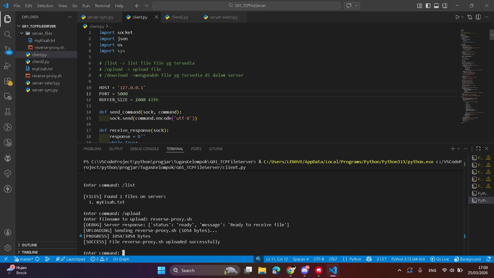
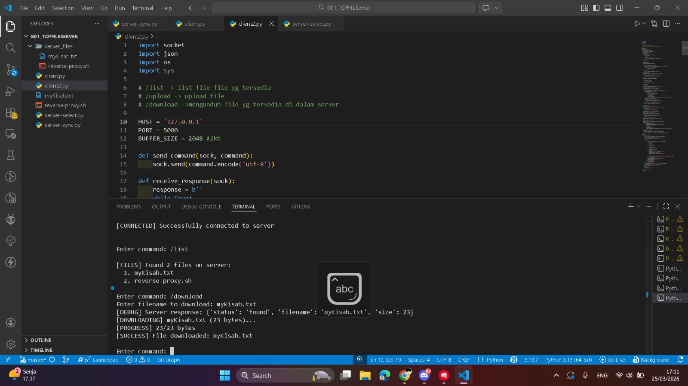
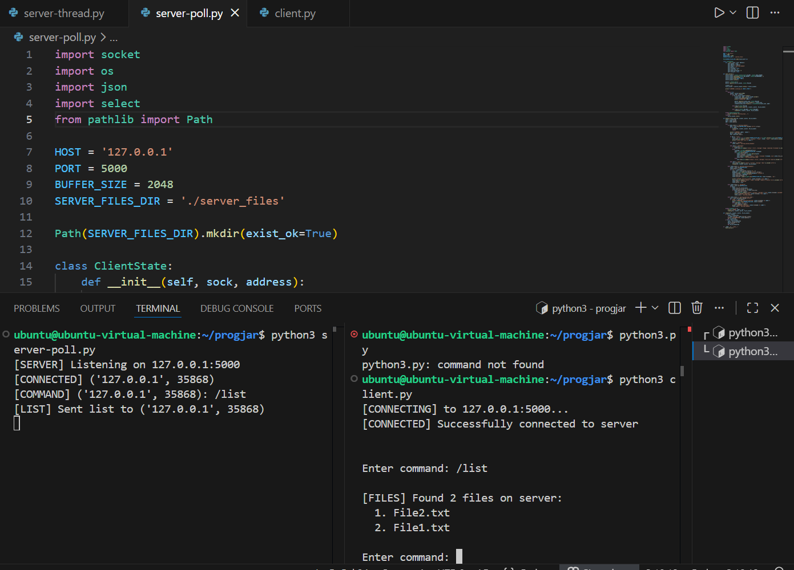
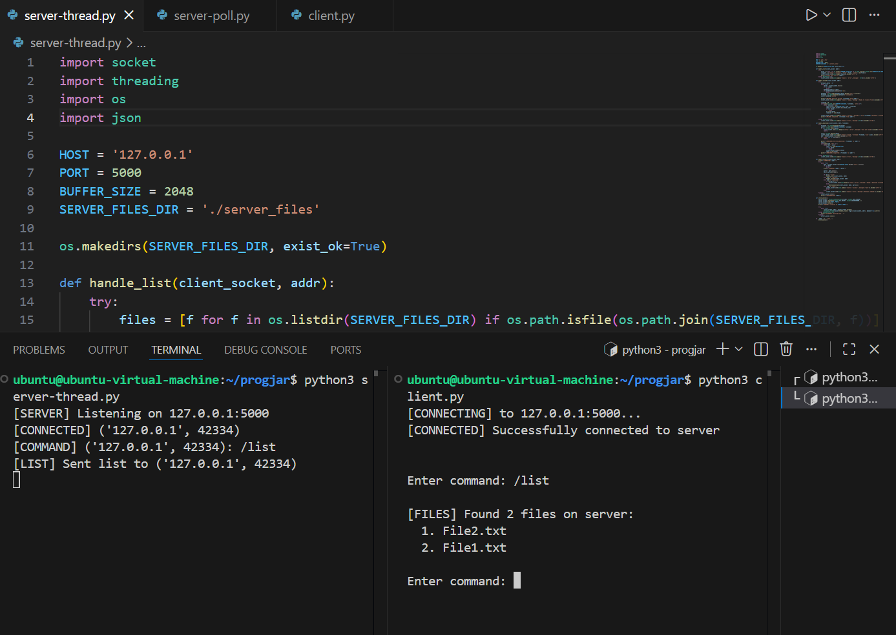

[](https://classroom.github.com/a/mRmkZGKe)
# Network Programming - Assignment G01

## Anggota Kelompok
| Nama           | NRP        | Kelas     |
| ---            | ---        | ----------|
| Rifat Qurratu Aini Irwandi               | 5025241233           | D          |
| Mayandra Suhaira Frisiandi               | 5025241240           | D          |

## Link Youtube (Unlisted)
Link ditaruh di bawah ini
```
https://youtu.be/-IpvYC0t9qU
```

## Penjelasan Program

Program ini terdiri dari 5 file python, 1 file client dan 4 file server dengan 4 metode berbeda.

### 1. client.py
  `client.py` bertujuan sebagai end user yang akan berinteraksi dengan semua server. 
  1. Klien menyiapkan alamat HOST (127.0.0.1) dan PORT (5000). Begitu program dijalankan, klien mencoba mengetuk pintu server. Jika server merespons, status menjadi [CONNECTED].
  2. Program masuk ke dalam loop untuk menunggu input dari user. Di sini, `fungsi main()` bertugas menangkap apa yang kamu ketik.
  3. Setelah user mengetik perintah seperti /list, fungsi `send_command` akan membungkus teks tersebut menjadi bytes dan mengirimkannya ke server.
  4. Setelah mengirim perintah, klien akan menjalankan fungsi `receive_response` untuk mendengarkan jawaban dari server. Server membalas dalam format JSON yang berisi status success atau error.
  5. Tipe-tipe response:
     - `/list`: user menerima daftar nama file dan menampilkannya di layar.
     - `/upload`: user mengirim info file (nama & ukuran), menunggu server bilang "Ready", lalu user mengirim isi filenya potongan demi potongan.
     - `/download`: user meminta file, server memberi tahu ukuran, klien bilang "Ready", lalu server mengirim data filenya ke user untuk disimpan.
     - `/quit` : User mengirim pesan putus ke server, lalu menutup koneksi `(sock.close())` dan program selesai.
       
### 2. server-sync.py
  `server-sync.py` berfungsi sebagai server yang memproses permintaan secara berurutan (Synchronous).
  1. Server menetapkan alamat HOST (127.0.0.1) dan PORT (5000). Fungsi `start_server()` menjalankan `bind()` dan `listen()` untuk mulai menerima koneksi masuk.
  2. Begitu client terhubung, fungsi `handle_client()` akan mengambil alih dalam sebuah perulangan (loop) untuk terus menerima data dari client tersebut menggunakan `recv()`.
  3. Setiap data yang masuk akan didekode dan dipisahkan menjadi bagian-bagian perintah melalui fungsi `data.split()`.
  4. Server memproses perintah berdasarkan kata kunci utama:
     - `/list`: Menjalankan fungsi `handle_list_command()` yang memanggil `get_file_list()` untuk membaca isi direktori `./server_files`, lalu mengirimkan daftar tersebut dalam format JSON.
     - `/upload`: Menjalankan `handle_upload_command()`. Server membaca metadata (nama & ukuran) hingga karakter `\n`, mengirim status ready, lalu membuka file lokal untuk menulis data bytes yang dikirim klien hingga jumlahnya sesuai dengan ukuran asli file.
     - `/download`: Menjalankan `handle_download_command()`. Server mengecek keberadaan file, mengirim metadata ke klien, menunggu konfirmasi ready, lalu mengirimkan seluruh isi file dalam bentuk potongan-potongan data.

  Karena bersifat Synchronous, server ini hanya bisa memproses satu klien secara utuh. Jika klien lain mencoba masuk, mereka akan tertahan antrian sampai fungsi `handle_client()` selesai menjalankan blok finally yang berisi `client_socket.close()`.

### 3. server-select.py
  `server-select.py` menggunakan fungsi `select.select()` untuk memantau status banyak socket secara bersamaan dalam satu loop.
  1. Server mengatur socket menjadi `setblocking(False)`. Ini memastikan server tidak akan berhenti hanya karena satu client belum mengirim data, server akan langsung berpindah memeriksa client lainnya.
  2. Karena server melayani banyak orang bergantian, ia menggunakan objek `ClientState` untuk mengingat setiap client sedang di tahap apa (mengirim perintah, mengunggah file, atau mengunduh file).
  3. Server menyimpan semua socket client ke dalam `sockets_list`.
  4. Fungsi `select.select()` bertindak sebagai pengawas yang memberi tahu server tahap socket.
  5. Jika `server_socket yang aktif`, artinya ada client baru. Server akan menerima koneksi dan memasukkannya ke daftar pantauan.
  6. Server memproses perintah berdasarkan kata kunci utama:
     - `/list`: Server mengambil daftar file dan langsung mengirimkannya kembali dalam format JSON.
     - `/upload`: Server masuk ke mode `waiting_upload_metadata`. Setelah metadata diterima, status berubah menjadi uploading, dan server akan menulis data ke file setiap kali potongan data tiba.
     - `/download`: Server masuk ke mode downloading, mengirim info file, menunggu pesan ready dari client, lalu mengirimkan isi file secara bertahap.
     - Jika klien memutus koneksi `/quit` atau terjadi error, server akan menghapus socket dari `sockets_list` dan menghapus data `ClientState` yang terkait agar memori tetap bersih.
       
### 4. server-poll.py
  `server-poll.py` menggunakan mekanisme Polling `(select.poll)` untuk melihat aktivitas pada banyak socket client melalui File Descriptor (FD).
  1. Server membuat objek poller dan mendaftarkan `server_socket` dengan bendera `POLLIN`. Ini berarti server sedang menunggu koneksi baru atau data masuk.
  2. Server menjalankan loop `poller.poll(1000)`. Fungsi ini akan berhenti sebentar dan hanya akan bangun jika ada aktivitas `event` pada salah satu socket, atau setelah menunggu selama 1 detik `timeout`.
  3. Sama seperti versi select, server menyimpan status setiap client dalam sebuah kamus berdasarkan nilai File Descriptor-nya.
  4. Jika FD yang aktif adalah milik server, maka `accept()` dijalankan, socket client diatur ke non-blocking, dan didaftarkan ke poller.
  5. Server memproses perintah berdasarkan kata kunci utama:
     - `/list`: Server langsung mengirimkan daftar file dalam folder `./server_files` dalam format JSON.
     - `/upload`: Server masuk ke state `waiting_upload_metadata`. Begitu metadata (JSON) diterima, server membuka file di folder tujuan dan berpindah ke state uploading untuk menerima potongan data hingga selesai.
     - `/download`: Server mencari file, mengirimkan ukurannya, menunggu balasan ready dari klien, lalu mengirimkan seluruh isi file menggunakan `sendall()`.
     - Jika terjadi `POLLERR` (error) atau `POLLHUP` (koneksi terputus), fungsi `cleanup()` akan otomatis mencabut socket dari poller, menutup file yang mungkin masih terbuka, dan mematikan socket client tersebut.
  
### 5. server-thread.py
  `server-thread.py` menggunakan library threading, memungkinkan beberapa client untuk melakukan aktivitas seperti upload atau download secara bersamaan tanpa saling menunggu.
  1. Di dalam fungsi `start_server()`, setiap kali ada koneksi yang diterima melalui `accept()`, server akan membuat objek `threading.Thread` baru.
  2. Thread baru tersebut ditugaskan untuk menjalankan fungsi `handle_client`. Dengan pengaturan `daemon=True`, thread client akan otomatis berhenti jika program utama server dimatikan.
  3. Server memproses perintah berdasarkan kata kunci utama:
     - `/list`: Fungsi `handle_list()` membaca direktori secara langsung dan mengirimkan hasilnya.
     - `/upload`: Fungsi `handle_upload()` menerima metadata, mengirim sinyal ready, lalu melakukan penulisan file ke folder `./server_files`.
     - `/download`: Fungsi `handle_download()` mengecek file, mengirim informasi ukuran, dan melakukan pengiriman data byte menggunakan `sendall()`.
  4. Setelah loop while True di dalam thread selesai karena perintah `/quit` atau koneksi putus, blok finally akan memastikan `client_socket.close()` dijalankan untuk membebaskan sumber daya.

## Screenshot Hasil

### 1. Sync
  
  
### 2. Select
  
  
### 3. Poll
  
  
### 4. Thread
  
